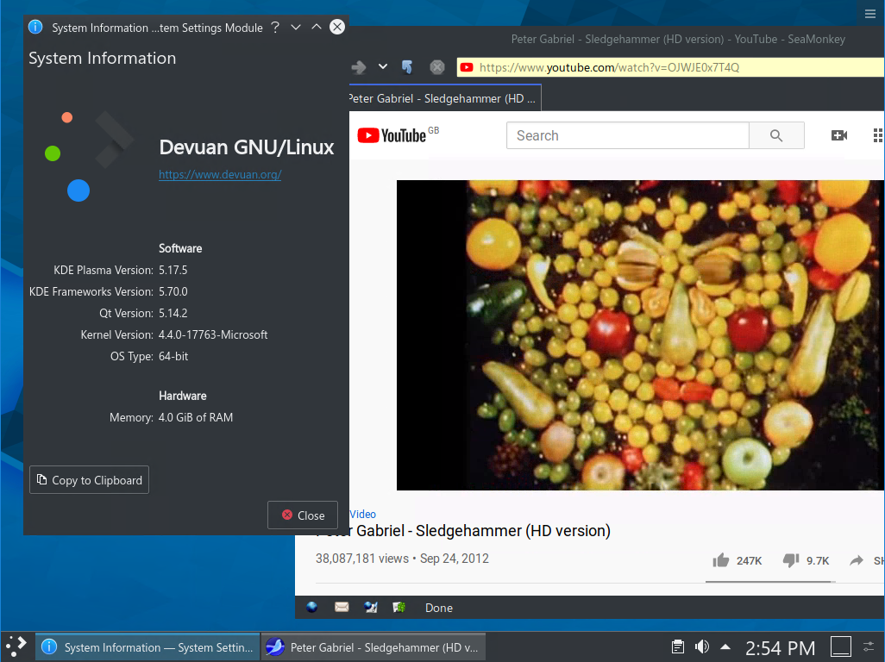

# kWSL.cmd

- Simplicity - A 'one-liner' sets up KDE in WSL, the quirks get resolved for you (see Wiki for details)
- Runs on Windows Server 2019 or Windows 10 Version 1803 (or newer, including Server Core)
- KDE 5.17 on Devuan Linux (Tracking with what is to become Debian Bullseye, only without systemd) 
- xRDP Display Server, no additional X Server downloads required
- RDP Audio playback enabled (YouTube playback in browser works)



**INSTRUCTIONS:  From an elevated CMD.EXE prompt change to your desired install directory and type/paste the following command:**

```
PowerShell -executionpolicy bypass -command "wget https://github.com/DesktopECHO/kWSL/raw/master/kWSL.cmd -UseBasicParsing -OutFile kWSL.cmd ; .\kWSL.cmd"
```

You will be asked a few questions.  The install script finds the current DPI scaling, you can set your own value if needed:

```
kWSL for Devuan Linux
Enter a unique name for the distro or hit Enter to use default [kWSL]:
Enter port number for xRDP traffic or hit Enter to use default [3399]:
Enter port number for SSHd traffic or hit Enter to use default [3322]:
Enter DPI Scaling or hit Enter to use default [96]:
kWSL to be installed in C:\kWSL
```

Exclusions will be automatically added to Windows Defender:

```
Added exclusion for C:\kWSL
Added exclusion for C:\kWSL\rootfs\bin\*
Added exclusion for C:\kWSL\rootfs\sbin\*
Added exclusion for C:\kWSL\rootfs\usr\bin\*
Added exclusion for C:\kWSL\rootfs\usr\sbin\*
Added exclusion for C:\kWSL\rootfs\usr\local\bin\*
Added exclusion for C:\kWSL\rootfs\usr\local\go\bin\*
```

The installer will download all the necessary packages to convert the Windows Store Debian image into Devuan Linux with KDE.
Near the end of the script you will be prompted to create a non-root user.  This user will be automatically added to sudo'ers.

```
Enter name of kWSL user: zero
Enter password: ********

      Start: Sat 07/25/2020 @ 14:05:11.49
        End: Sat 07/25/2020 @ 14:15:49.42
   Packages: 962

  - xRDP Server listening on port 3399 and SSHd on port 3322.

  - Links for GUI and Console sessions have been placed on your desktop.

  - (Re)launch init from the Task Scheduler or by running the following command:
    schtasks /run /tn kWSL

 kWSL Installation Complete!  GUI will start in a few seconds...
```

Currently you should see approximately 962 packages installed.  If the number reported is much lower it means you had a download failure and need to re-start the install.

Upon completion you'll be logged into an attractive and fully functional KDE Plasma.  A scheduled task is created for starting/managing kWSL. 

   **If you want to start kWSL at boot (like a service with no console window) do the following:**

   - Right-click the task in Task Scheduler, click properties
   - Click the checkboxes for **Run whether user is logged on or not** and **Hidden** then click **OK**
   - Enter your Windows credentials when prompted

   Reboot your PC.  kWSL will automatically start at boot, no need to login to Windows.

**Convert to WSL2 Virtual Machine:**
-  kWSL will convert easily to WSL2.  Only one additional adjustment is necessary; change the hostname in the .RDP connection file to point at the WSL2 instance.  First convert the instance:
    ```wsl --set-version [DistroName] 2```
- Assuming we're using the default distro name of ```kWSL``` (use whatever name you assigned to the distro)  Right click the .RDP file in Windows, click Edit.  Change the Computer name to your Windows hostname plus **```-kWSL.local```**  Your WSL2 instance resolves magically using multicast DNS (Thanks Apple!) 
- For example, if the current value is ```LAPTOP:3399```, change it to ```LAPTOP-kwsl.local:3399``` and save the connection file.  

**Make it your own:**

From a security standpoint, it would be best to fork this project so you (and only you) control the packages and files in the repository.

- Sign into GitHub and fork this project
- Edit ```kWSL.cmd```.  On line 2 you will see ```SET GITORG=DesktopECHO``` - Change ```DesktopECHO``` to the name of your own epository.
- Customize the script any way you like.
- Launch the script using your repository name:
 ```PowerShell -executionpolicy bypass -command "wget https://github.com/YOUR-REPO-NAME/kWSL/raw/master/kWSL.cmd -UseBasicParsing -OutFile kWSL.cmd ; .\kWSL.cmd"```

**Quirks Addressed / Additional Info:**
- kWSL should work fine with an X Server but this has not been tested thoroughly.  The file ```/etc/profile.d/WinNT.sh``` contains WSL-centric environment variables that may need adjustment such as LIBGL_ALWAYS_INDIRECT.
- WSL1 Has issues with the latest libc6 library.  The package is being held until fixes from MS are released over Windows Update.  Unmark and update libc6 after MS releases the update.
- WSL1 Doesn't work with PolicyKit.  Pulled-in GKSU and dependencies to accomodate GUI apps that need elevated rights.  
- Patched KDE Lockscreen and KDE Activity Manager to resolve shared memory and PolicyKit issues
- Rolled back and held xRDP until the current update is better-behaved (xrdp-chansrv high CPU %)
- Current versions of Chrome or Firefox do not work in WSL1; Mozilla Seamonkey is included as the 'official' stable/maintained browser
- Installed image consumes approximately 2.6 GB of disk space
- KDE uses the Breeze-Dark theme and Windows fonts (Segoe UI / Consolas)
- Copy/Paste of text and images work reliably between Windows and Linux
- This is a basic installation of KDE to save bandwidth.  If you want the **complete** KDE Desktop environment run ```sudo apt-get install kde-full``` 
